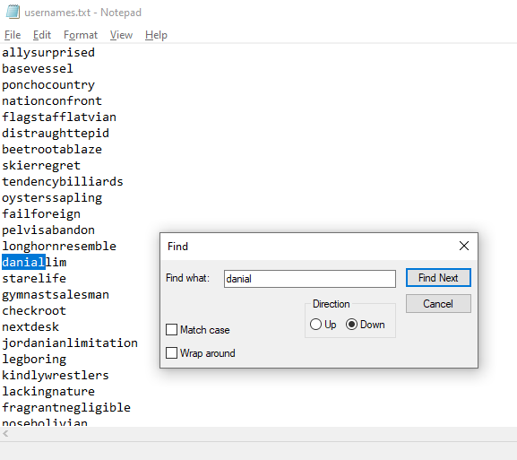
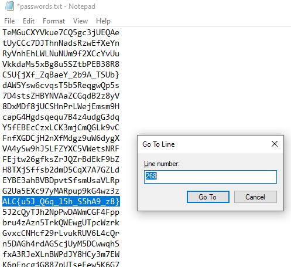
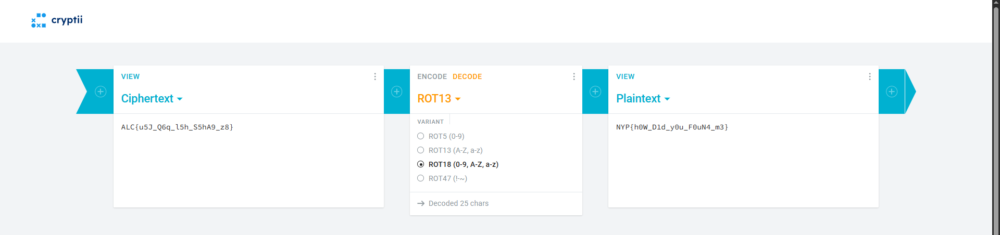

# Fireworks2026 - New Year Credential Leak

**Difficulty: very easy**  
**Points: 500 --> 356 **  
**Solves: 18**  

---

## Hints

---

## Challenge Description

During the New Year 2026 celebration, Fireworks2026 Marketplace accidentally leaked a list of usernames and encrypted passwords from one of its old test servers. Can you find the password of the user "Danial Lim", and successfully decrypt it? Download the leak here. The first user in usernames.txt corresponds to the first password in passwords.txt. The second user corresponds to the second password, and so on.

---

## Solve

I went into the usernames.txt and pressed Ctrl + F to search for Danial

I pressed Ctrl + G to find the line number, which is 268, and went to line 268 in passwords.txt

The password is: ALC{u5J_Q6q_l5h_S5hA9_z8}, which looks like it can be decrypted using shift cipher

I first used caeser cipher to decrypt it, however it was wrong. Result: NYP{h5W_D6d_y5u_F5uN9_m8}

Afterwards I tried ROT18 cipher decoder which shifts numbers too

Flag: NYP{h0W_D1d_y0u_F0uN4_m3}

