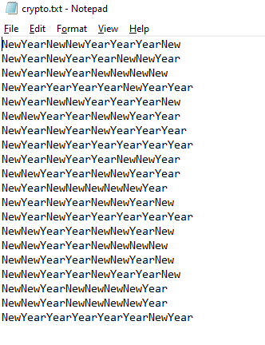
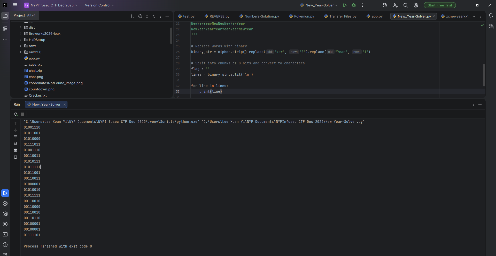

# New Year

**Difficulty: very easy**  
**Points: 500 --> 416**  
**Solves: 14**  

---

## Hints

---

## Challenge Description

Happy New Year!

---

## Solve

There's 8 words in a line, which leads me to think it is in binary.

I assume that 'New' = 0 and 'Year' = 1

I wrote a python script to help convert it all into binary: 

I went to RapidTables to convert binary to ASCII:

The flag is: NYP{N3W_Y3AR_2026!!}