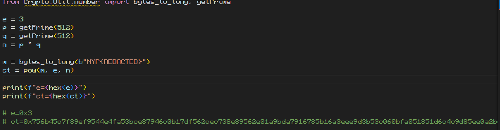
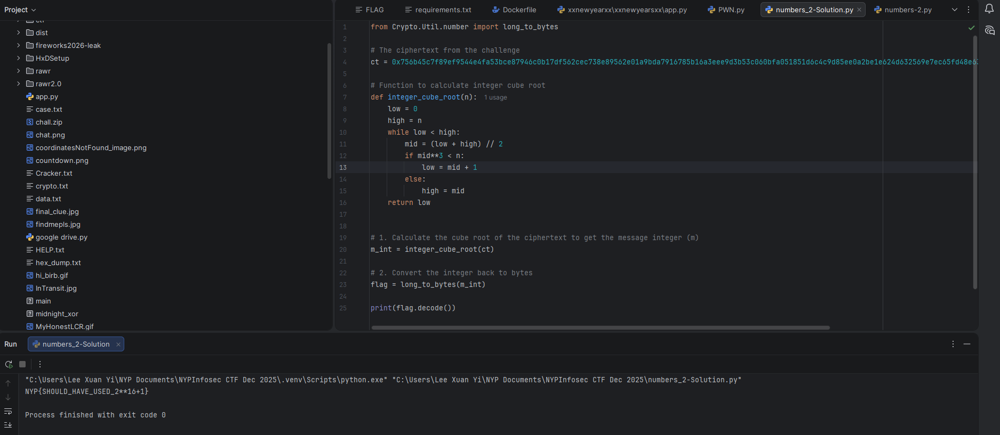

# Numbers 2

**Difficulty: easy**  
**Points: 500 --> 450 **  
**Solves: 11**  

---

## Hints

---

## Challenge Description

What is a N

---

## Solve

The challenge provides an RSA encryption script where the public exponent `e` is 3.

RSA security relies on the message wrapping around the modulus n. However, if the message m is short and e is small (like 3), the result m^3 might be smaller than n.

If m^3 < n, the modulus operation effectively does nothing. The ciphertext is just the message cubed. To recover the flag, we only need to calculate the cube root of the ciphertext.

I wrote a script to find the cube root and convert the number back to text.

The flag is: NYP{SHOULD_HAVE_USED_2**16+1}
