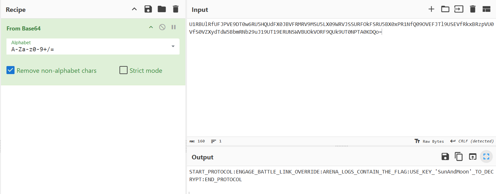
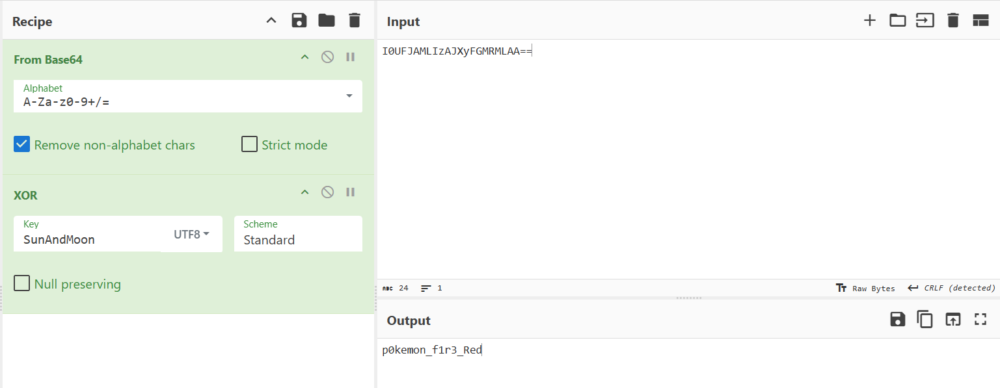

# Pokemon Battle Logs

**Difficulty: easy**  
**Points: 500 --> 372**  
**Solves: 17**  

---

## Hints

---

## Challenge Description

During the Poké Cup 2025 finals, a high-intensity battle unfolded between Ash Ketchum and Team Rocket. All battle actions, commands, and system interactions were automatically recorded by the PokéTech Battle Logging System (PBLS). However, referees detected irregular transmissions inside the logs. These logs seem to have been tampered with by Team Rocket to disrupt or manipulate the battle.

---

## Solve

In the rules, it said that the key is XORed with a secret key and result is encoded using Base64.

All of Team rocket's message when decoded from Base64 translates to: "START_PROTOCOL:ENGAGE_BATTLE_LINK_OVERRIDE:ARENA_LOGS_CONTAIN_THE_FLAG:USE_KEY_'SunAndMoon'_TO_DECRYPT:END_PROTOCOL"

There's a message at the bottom of the battle logs: I0UFJAMLIzAJXyFGMRMLAA==

When decoded from Base64 and XORed with key 'SunAndMoon' it outputs:

Flag: NYP{p0kemon_f1r3_Red} 