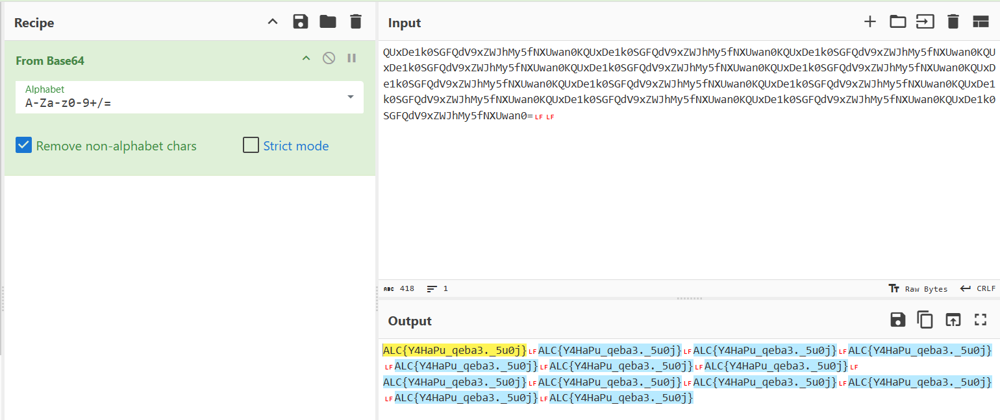
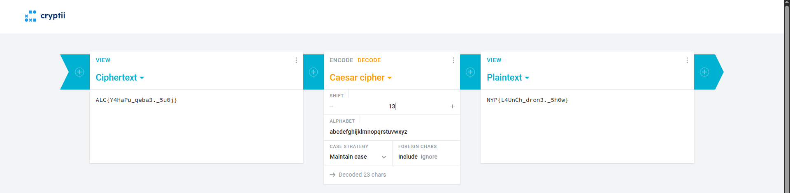

# Save the Drone Show

**Difficulty: very easy**  
**Points: 500 --> 440**  
**Solves: 12**  

---

## Hints
- Try counting the number of words in the console message...

---

## Challenge Description

The school prepared a drone show for the New Year celebration, but just hours before launch, an attacker broke into the system.

They encoded the main launch command, rendering it unusable for starting the show. There is one message scribbled on the console.

Can you decode the command and save the show?

---

## Solve

In case.txt, it mentioned that it is encoded with simple encoding techniques and letter-shifting ciphers. 

In data.txt, the encoded text is: "QUxDe1k0SGFQdV9xZWJhMy5fNXUwan0KQUxDe1k0SGFQdV9xZWJhMy5fNXUwan0KQUxDe1k0SGFQdV9xZWJhMy5fNXUwan0KQUxDe1k0SGFQdV9xZWJhMy5fNXUwan0KQUxDe1k0SGFQdV9xZWJhMy5fNXUwan0KQUxDe1k0SGFQdV9xZWJhMy5fNXUwan0KQUxDe1k0SGFQdV9xZWJhMy5fNXUwan0KQUxDe1k0SGFQdV9xZWJhMy5fNXUwan0KQUxDe1k0SGFQdV9xZWJhMy5fNXUwan0KQUxDe1k0SGFQdV9xZWJhMy5fNXUwan0KQUxDe1k0SGFQdV9xZWJhMy5fNXUwan0KQUxDe1k0SGFQdV9xZWJhMy5fNXUwan0KQUxDe1k0SGFQdV9xZWJhMy5fNXUwan0="

Since it ended with "=" it is encoded in Base64

When decoded from Base64, it produced:

The same text of "ALC{Y4HaPu_qeba3._5u0j}" was repeated, which looks like a flag

Afterwards I went to a shift cipher decoder and bruteforce possible shifts. Shift 13 decrypts the cipher:

The flag is: NYP{L4UnCh_dron3._5h0w}