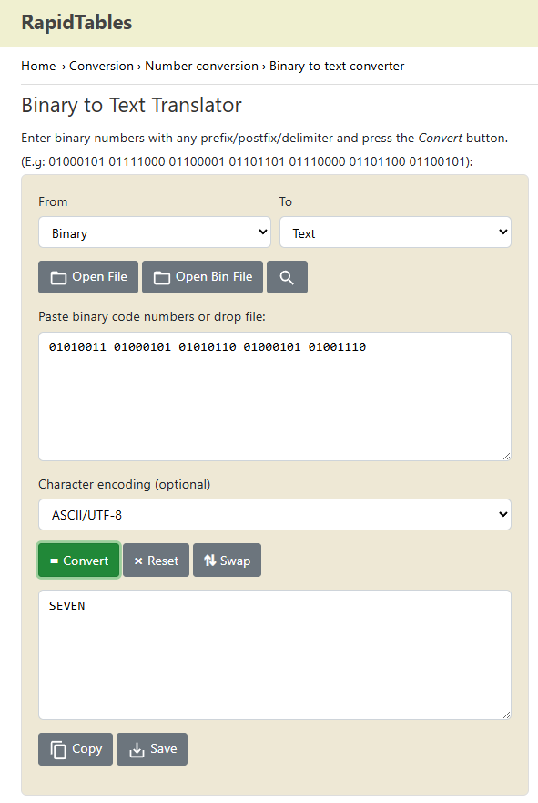
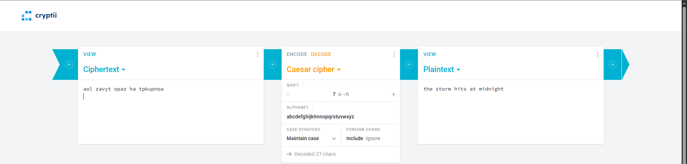

# The Lighthouse Signal

**Difficulty: easy**  
**Points: 500 --> 402**  
**Solves: 15**  

---

## Hints

---

## Challenge Description

You have been tasked to decode the binary and messages as your very first task of the year.

Flag format: NYP{the_secret_message_in_lowercase_separated_by_underscores} (No spaces)

---

## Solve

The binary:'01010011 01000101 01010110 01000101 01001110' decodes to SEVEN 

Afterwards, I used shift cipher with shift of 7 to decode the message: "aol zavyt opaz ha tpkupnoa", which translates to:

The flag is:NYP{the_storm_hits_at_midnight} 
