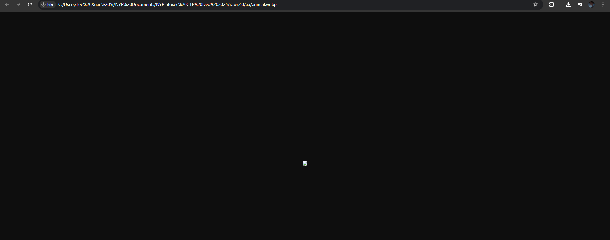
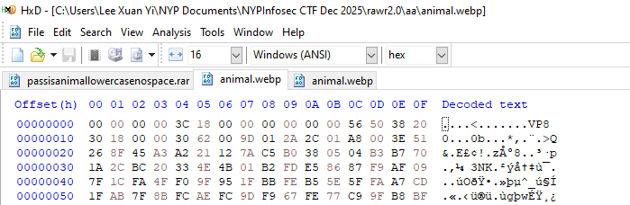
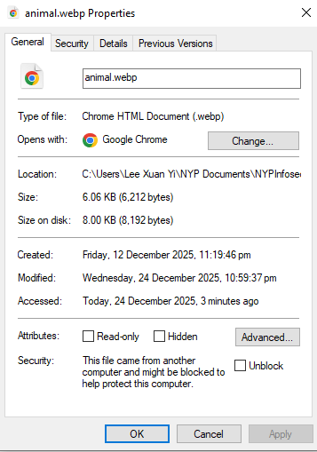
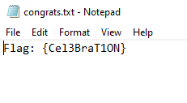

# hexingmagic

**Difficulty: easy**  
**Points: 500 --> 498 **  
**Solves: 3**  

---

## Hints
- Use hexedit, and remember the magic number!

---

## Challenge Description

You’ve received a mysterious file from your friend. Your friend promises that if you solve it, you’ll get some good fortune for next year. As a hint, they tell you that they’ve used magic to edit the file. Figure out the code!

---

## Solve

The 2 files inside rawr includes an animal.webp and passisanimallowercasenospace.rar. Inside passisanimallowercasenospace theres a congrats.txt which requires a password.

When I opened animal.webp, it did not open so I need to fix it to make it open. 

I downloaded HxD to manipulate the hex to fix the file. 

In HxD, I found that the file has a corrupt header (it's all zeros for first part), and ends with VP8, which is a WebP image.

To fix the file, reconstruct the standard WebP header structure as follows:
- Offset 00-03: 52 49 46 46 (ASCII: RIFF)
- Offset 04-07: 3C 18 00 00 (File Size) --> Explained below 
- Offset 08-0B: 57 45 42 50 (ASCII: WEBP)

File size is calculate by going to properties and converting the bytes to hexadecimal. 6212 bytes --> 18 3C --> Little endian way is 3C 18  

After changing the header, the image opened is:

I assume that's the password and entered stickbug as the password for congrats.txt, which is correct

The flag is: NYP{Cel3BraT1ON}
