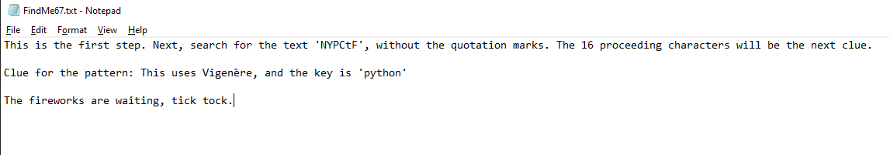
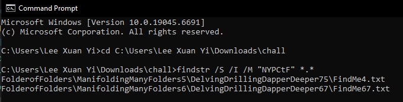
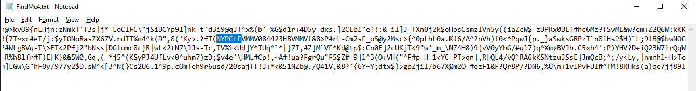
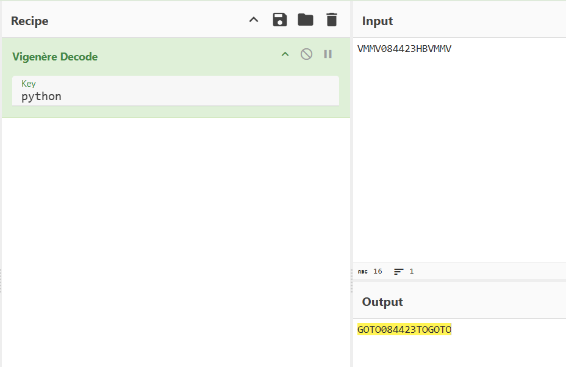
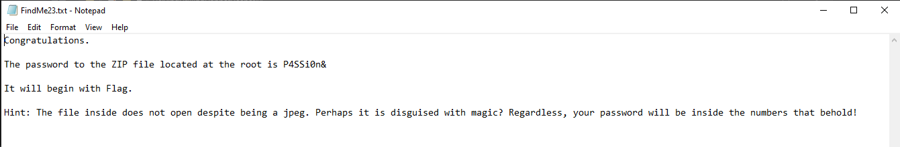
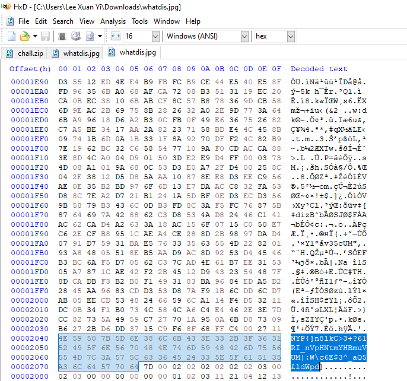

# itsfoldersallthewaydown

**Difficulty: easy**  
**Points: 500**  
**Solves: 2**  

---

## Hints
- The sticky note contains a path.
- Use hexedit on the image file

---

## Challenge Description

You’re in charge of launching the fireworks for tonight’s New Year’s celebration, but disaster has struck. The password for the launch is buried under several hundreds of folders and .txt files. Your only clue is a sticky note that reads, “6,67,67”.Find the password!

File: https://drive.google.com/file/d/17X13_gI7PKn8wcz40Lq5u2kzl1RunjJt/view?usp=sharing

---

## Solve

There are lots of folders here with a file called "whatdis.rar" which requires a password. The clue "6,67,67" appears to be the path to the first clue, so i followed it and found a "FindMe67.txt"

The clue is to search for the text 'NYPctf' among the many folders and files. 

To do this, I run the command "findstr /S /I /M "NYPCtF" *.*" in command prompt in the root folder
- /S searches all sub folders
- /I so search is not case-sensitive
- /M to only show file names
- "NYPctf" is the string to search
- *.* to search all files

The command leads me to "FolderofFolders\ManifoldingManyFolders5\DelvingDrillingDapperDeeper75\FindMe4.txt"

The 16 proceeding characters after 'NYPctf' are 'VMMV084423HBVMMV', which when decoded using key 'python' for vignere cipher, produces the following results:

Results are: 'GOTO084423TOGOTO', which appears to be the file path for the 8th folder, 44th folder and 23rd file. At the destination is the file 'FindMe23.txt'

The password to the file is 'P4SSi0n&'. After entering the password into the file 'whatdis.rar', it shows a jpeg file which won't open. I extracted the file and tried fixing it using HxD (Hex editor), but it didn't work.

However, when i pressed Ctrl + F and searched for the keyword 'NYP', I found the flag:

The flag is: NYP{]n8lkC>3+?61RI_nVpHNtmYHBmuVUM|:W\c6E$3^_aQ5£ldWpd}