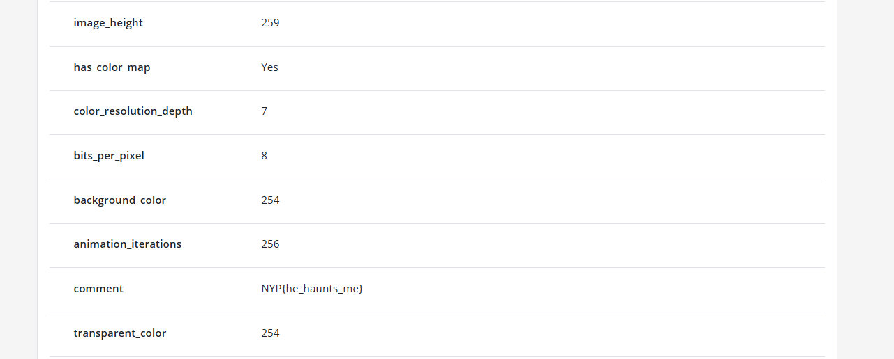

# ugly frog

**Difficulty: very easy**  
**Points: 500 --> 356**  
**Solves: 18**  

---

## Hints
- https://infosecwriteups.com/beginners-ctf-guide-finding-hidden-data-in-images-e3be9e34ae0d

---

## Challenge Description

Please get me away from it.

---

## Solve

Go to metadata2go.com to check metadata of images and insert ugly_frog1.gif

The "comment" section in the metadata reveals the flag:

The flag is: NYP{he_haunts_me}
