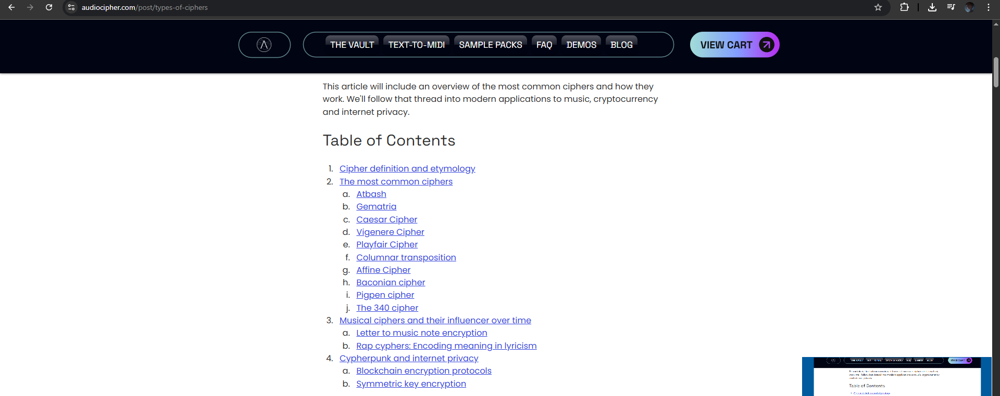
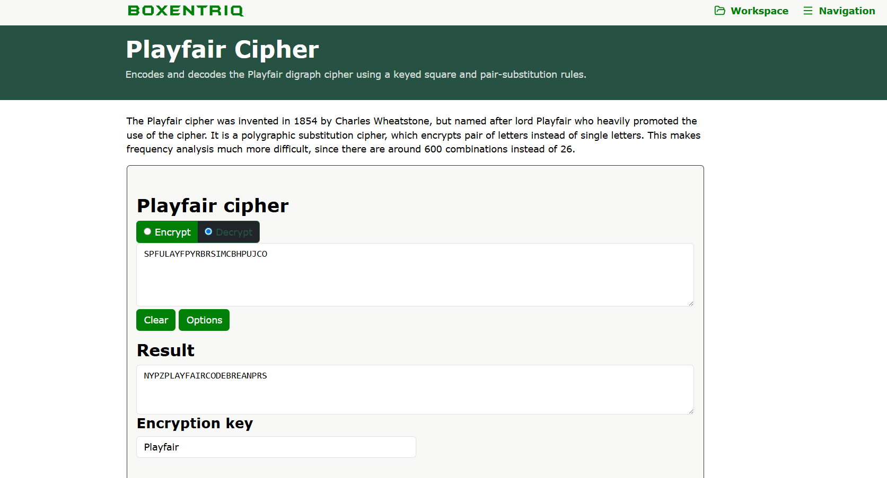

# Be Nice

**Difficulty: easy**  
**Points: 500**  
**Solves: 1**  

---

## Hints

---

## Challenge Description

Deep in the dungeons, there is an old, locked chest with an mechanical keypad lock. Inscribed on the wall behind it reads: "Be Nice; SPFULAYFPYRBRSIMCBHPUJCO" Can you figure out what it means and loot the treasures from within? Flag format: All contents of flag must be cleaned up to uppercase proper english words.

---

## Solve

From the description, the text "SPFULAYFPYRBRSIMCBHPUJCO" looks like a type of cipher. Therefore, Be Nice should be a clue to how to decrypting it.

I googled for common types of cipher and found a cipher called "PlayFair" cipher which sounded similar to the clue "Be Nice"

Afterwords I went to a Playfair cipher decoder website and decoded the text

The result was NYPZPLAYFAIRCODEBREANPRS, which when cleaned up into proper english words is NYP{PLAYFAIRCODEBREAKERS}
