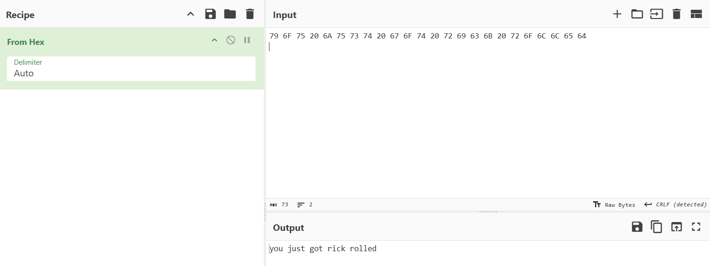
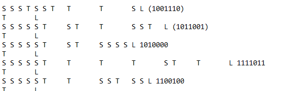

# Note to self

**Difficulty: easy**  
**Points: 500 --> 388 **  
**Solves: 16**  

---

## Hints 

---

## Challenge Description

A junior analyst left this note on your desk. He says there’s nothing special about it…but you get the feeling he’s hiding something. Can you decode the message?

---

## Solve

In the file, there is a hexadecimal text, when translated is a red herring.

The text below are written in the esoteric programming language Whitespace.
- S = Space (0)
- T = Tab (1)
- L = Line Feed (End of instruction)

Translate each line starting at the letter "T"
E.g. S S S T	S S T	T	T	S L --> (1001110)

The result is a binary text, which when converted to ASCII gives the flag:

