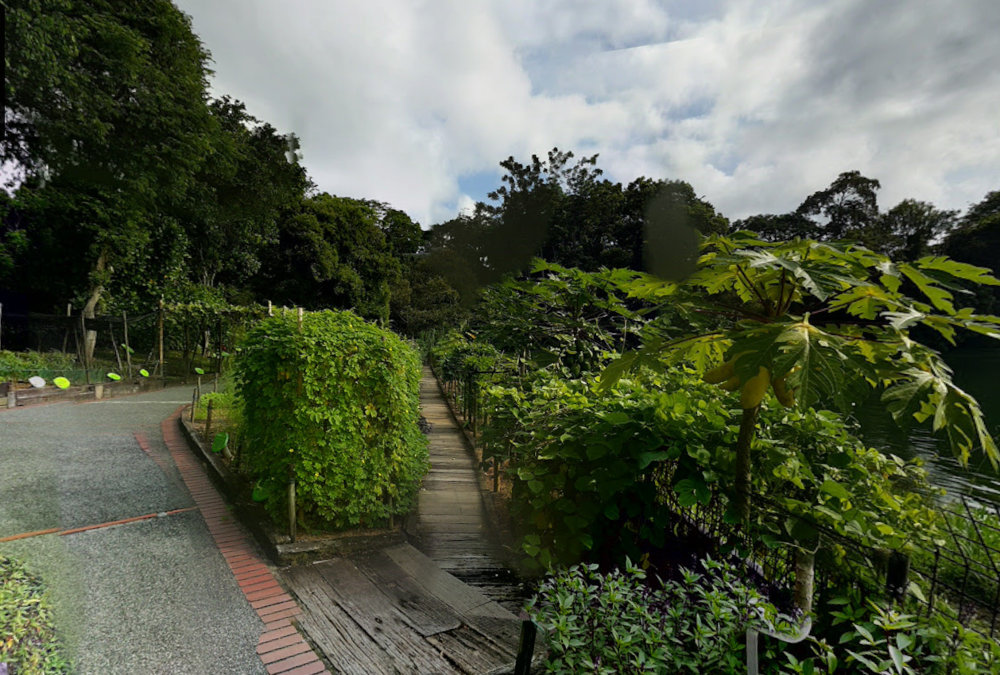
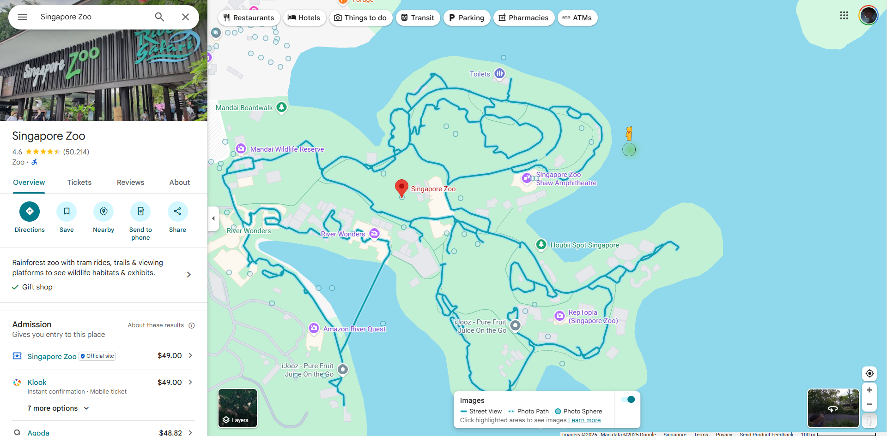
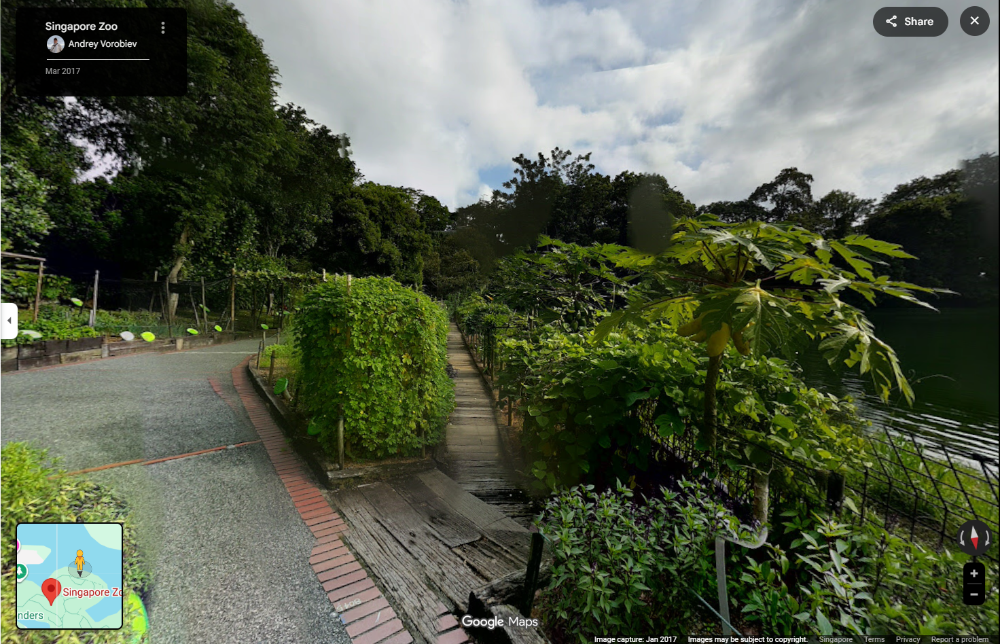

# Coordinates not found

**Difficulty: easy**  
**Points: 500 --> 488**  
**Solves: 6**  

---

## Hints

---

## Challenge Description

At first glance, it appears to be a quiet footpath surrounded by dense greenery. But looks can be deceiving. This location sits close to a well-known attraction, visited by thousands, home to thousands, yet rarely examined closely. Your task is to determine exactly where this photo was taken. Not the attraction, not the general area. Submit the precise latitude and longitude coordinates of the camera position. (to 3dp) Flag Format: NYP{latitude, longitude}

---

## Solve

The image given is

I did a reverse google image searched and found an image very similar to it.

At first I searched on the path in google maps for a few hours but couldn't find the exact image. However, I tried hovering the yellow man above google maps and found that there were actually areas NOT on the routes that I could go to.

I chose the area furthest away from the zoo since it was what the challenge description wanted and I found the exact location it can found

I tried entering the exact coordinates to 3dp but it didn't work. So i brute force my way until it did.

The flag is: NYP{1.406, 103.795}
