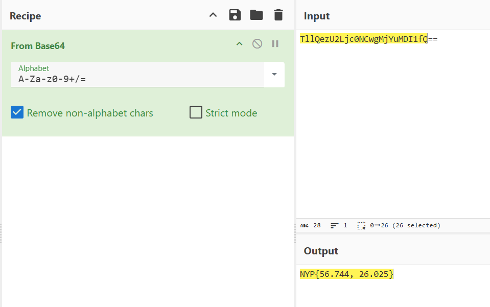

# Holiday Disaster

**Difficulty: very easy**  
**Points: 500 --> 460**  
**Solves: 10**  

---

## Hints
- chat.png is useless for solving the challenge :)
- maybe check the metadata?

---

## Challenge Description

A student from NYP got lost in an European Country during the New Year's break. You have one clue, can you find him? (3dp)

---

## Solve

When I opened findmepls.jpg and pressed the details button, the description "HELPMEPLSIMSTUCKINLATVIA-TllQezU2Ljc0NCwgMjYuMDI1fQ==" appeared

The 2nd part of the message "TllQezU2Ljc0NCwgMjYuMDI1fQ==" is encoded in Base64 since it ends with "=="

When decoded from Base64 it outputs:

The flag is: NYP{56.744, 26.025}