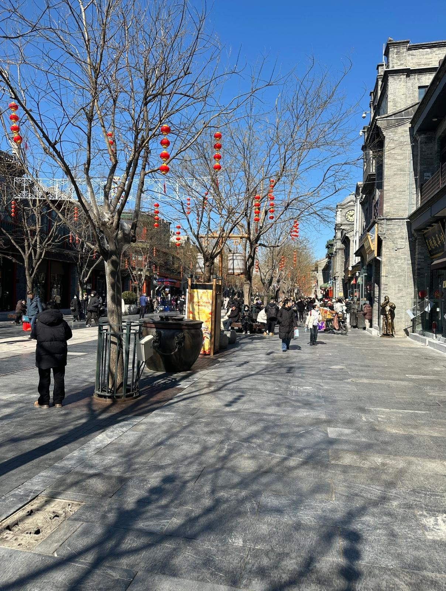
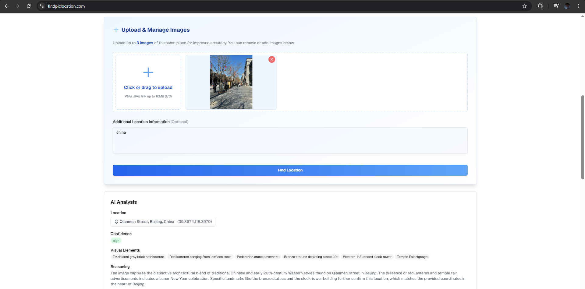
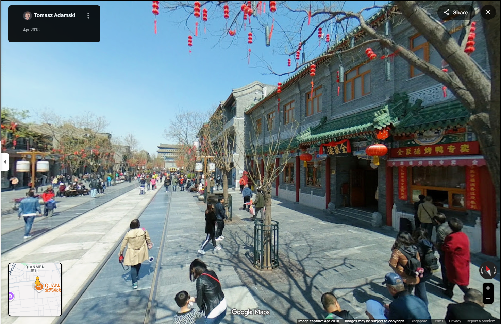
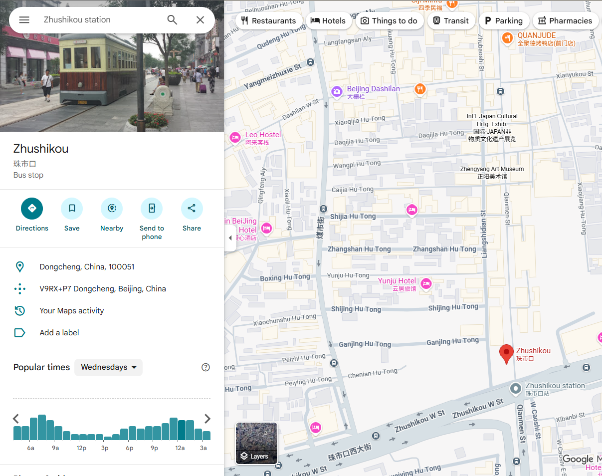

# In Transit

**Difficulty: very easy**  
**Points: 500 --> 460**  
**Solves: 10**  

---

## Hints

---

## Challenge Description

Hmmm Where is the nearest bus stop?

Flag format: NYP{bus_stop_lowercase_separated_by_underscore}

---

## Solve

First I upload the image into "https://findpiclocation.com/" to find the general area of the photo.

The image was taken at Qianmen Street, Beijing, China. I went there using google maps and looked around for similar locations to the image.

Afterwards I went to google map and searched for the nearest station. I tried many nearby stations but it didn't work. However after a while, the one that worked was "Zhushikou"

The flag is: NYP{zhushikou}