# SocialMediaAndTime

**Difficulty: easy**  
**Points: 500**  
**Solves: 2**  

---

## Hints
- Use the Wayback Machine

---

## Challenge Description

Just a few hours before nightfall, your friend has decided to play a game with you to figure out where to meet to celebrate the new year. Search around their social medias to figure out where they could possibly be!

---

## Solve

Inside the "twitterlink.txt" file contains a link to a twitter profile

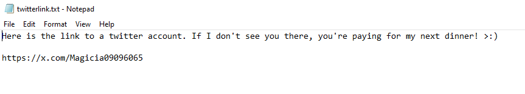

The link leads to a twitter profile

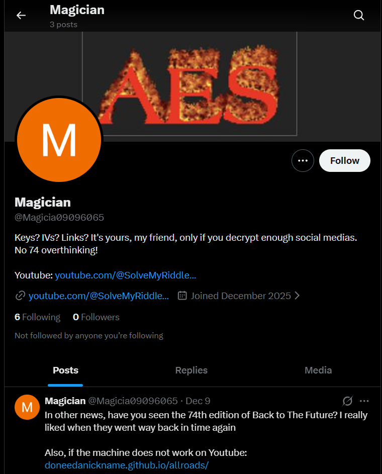

His posts contains:
- IV (badf595c4578825005fbe3210449f5d9c96d47a407cebe519aae3da7e686bcf8681f984c8010bf3be2187d8eb7867bb1) 
- Key (22a414fe29788d6ba57ecb7d4a64656511f3c9aaf24f9cc73babb9dd8c4117eea812ffc4368b5a362cacb114c4382a4c)

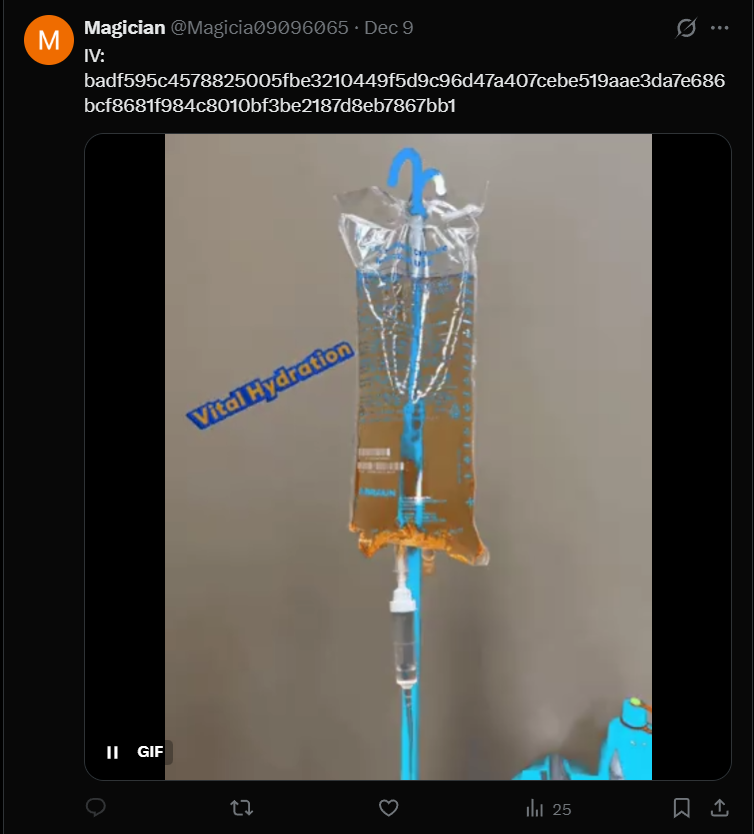
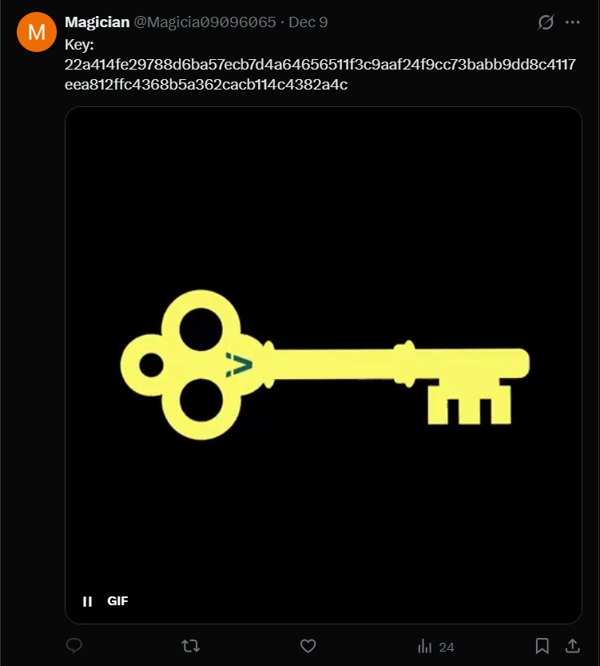

His profile also contains a youtube account link, which has a description of a link where we need to decrypt: https://drive.google.com/drive/folders/d113a58460797408a5c32fbb7acfc0f4a7bf1f103c510f46e71deccacb5e9d98433aecf8e17f83b2d7ca2db5e8d7d818 

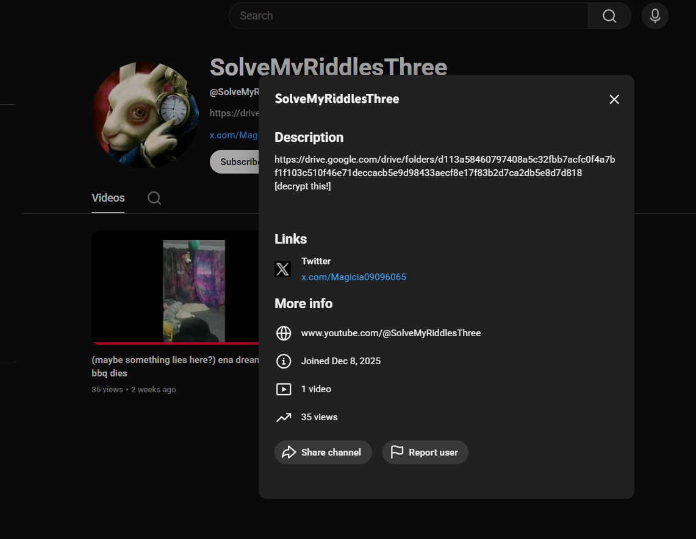

He has a youtube video which has a description: hi74t her head so hard she travels way back in time74. check twi74tter if this doesn't work

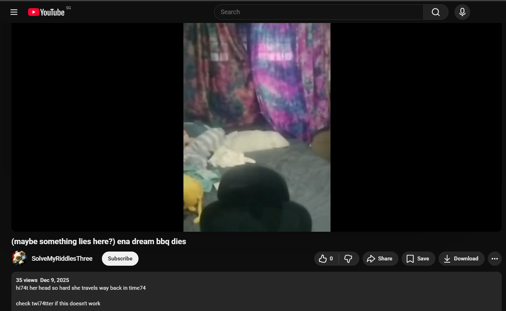

I tried to decrypt the google drive link using AES with the IV and Key given in his Twitter account but it didn't work as it was the incorrect length. 

His twitter account contains a lot of reference to time travel, so I used the Wayback Machine on his youtube video, which reveals:
- IV (30313233343536373839405142434445)
- Key (546573745F4B65793132333435366738)

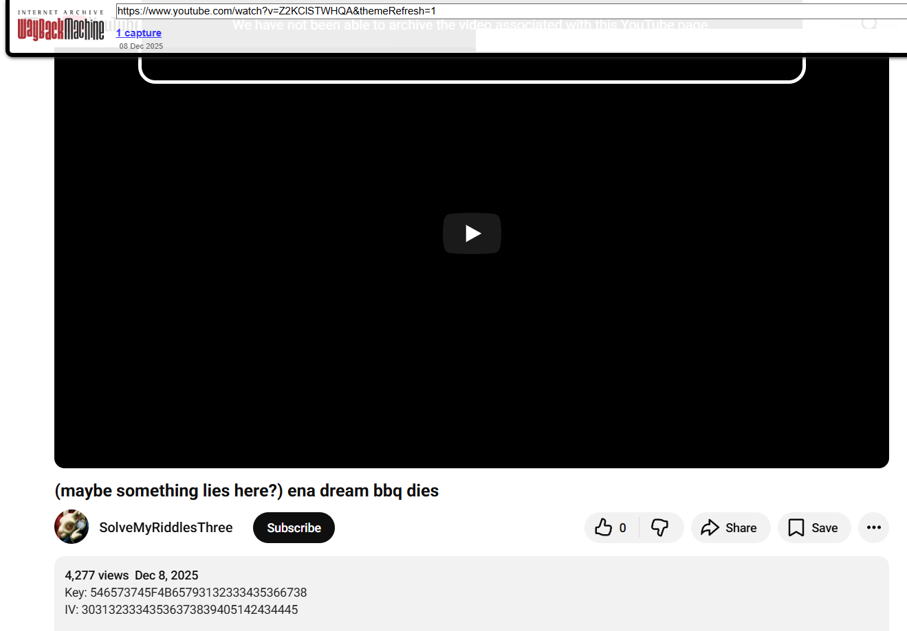

I rearranged the Github repo link from doneedanickname.github.io/allroads/ to https://github.com/doneedanickname/allroads/ and went to his commits, which shows the same IV and Key

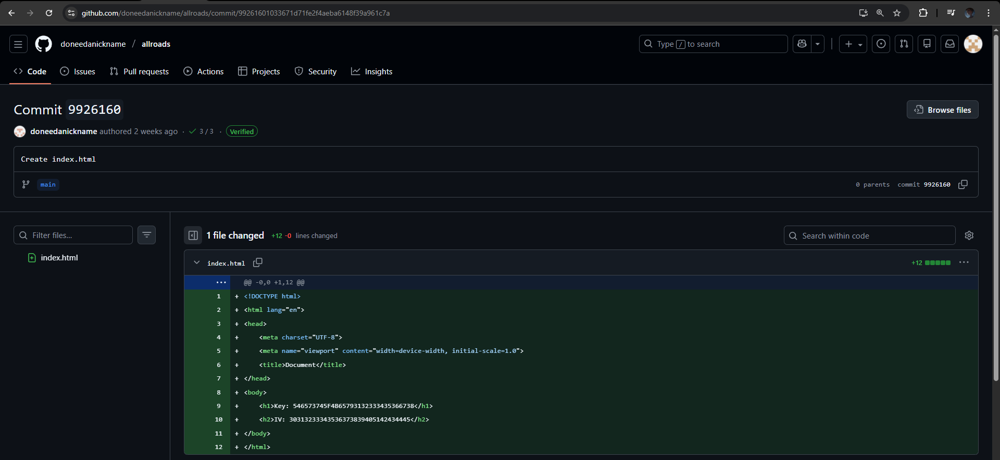

The IV and Key still do not work to decrypt the link. Which frustrated me, but then I considered decrypting the original IV and Key provided using the IV and key found in the wayback machine.

Decrypted IV: 30313233343536373839404142434445

Decrypted Key: 546573745F4B65793132333435363738
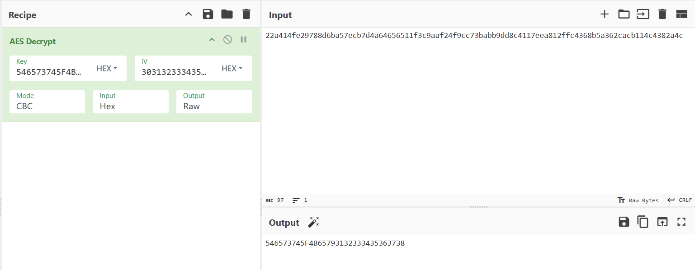

Finally I decrypted the google drive link using the decrypted IV and Key, which gives https://drive.google.com/drive/folders/1o9hTYLr_iHMwJLDgq0jKsJkkV-4w0oFC?usp=sharing

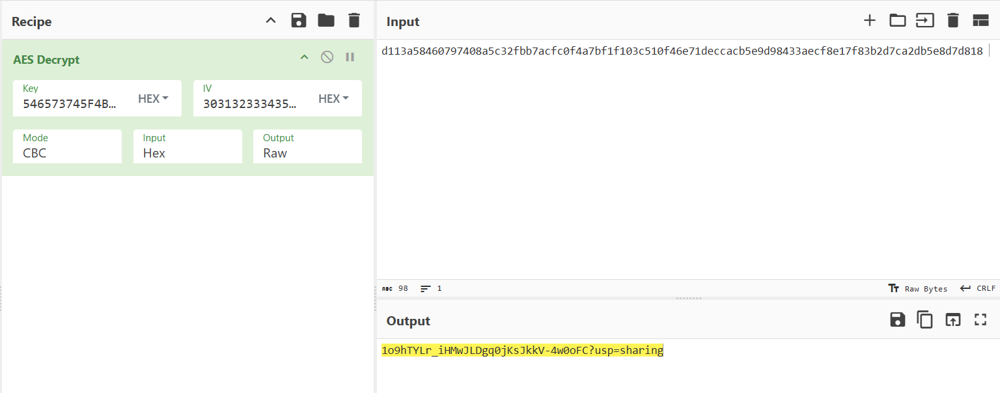

Inside the drive contains 100 google docs

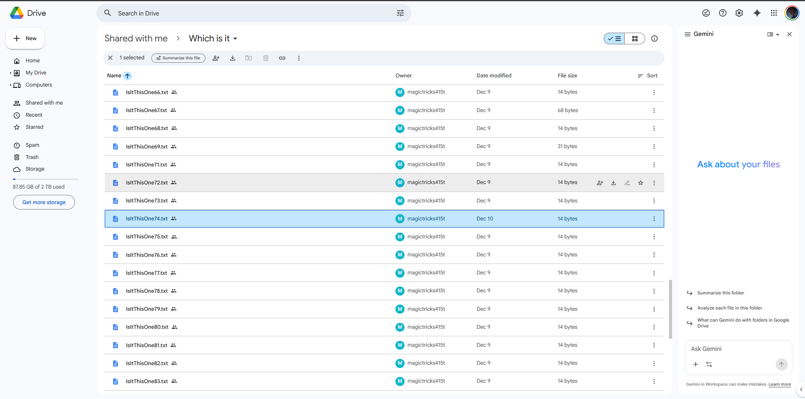

Since the number 74 was repeated so much in the twitter and youtube page, I went to "IsItThisOne74.txt" 

The flag is: NYP{MaR1NAbAy}