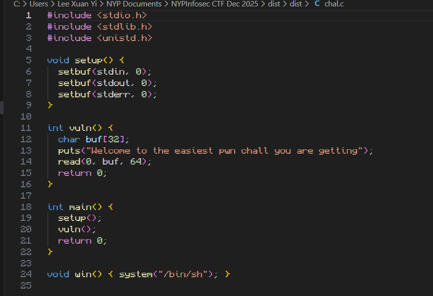
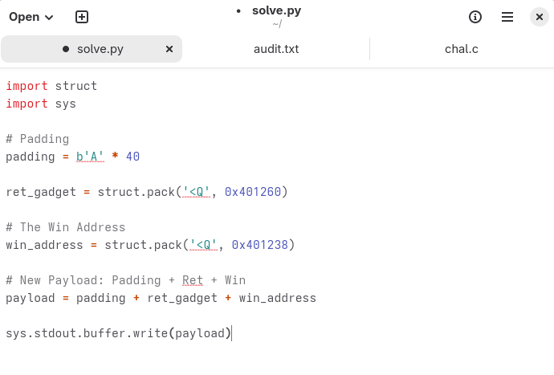
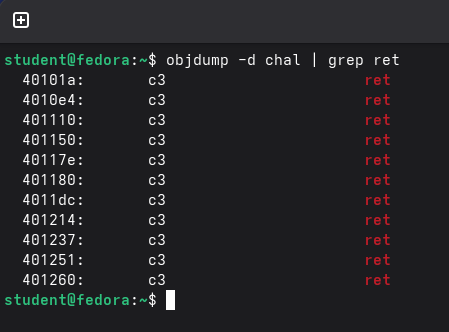
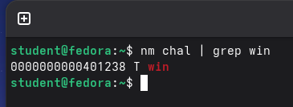
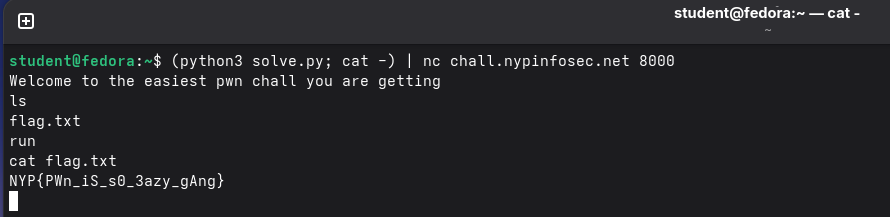

# freepwn

**Difficulty: very easy**  
**Points: 500 --> 476 **  
**Solves: 8**  

---

## Hints

---

## Challenge Description

This is going to be the easiest pwn challenge you get.

nc chall.nypinfosec.net 8000

---

## Solve

I searched online and found that a Linux environment is required to do this challenge. 

In the 'chal.c' file in the 'dist' folder, it has the code:

The 'int vuln()' function has a 'read(0, buf, 64);' function and a buffer of 64. Therefore, we are gonna perform a buffer overflow attack.

I've written this script to perform the attack:

- Padding with 40 A's: To overwrite the Return Address, you must first fill the Buffer (32) and the Saved RBP (8). 32 + 8 = 40 bytes.
- ret_gadget: Needed for stack alignment. On 64-bit Linux, the stack must be a multiple of 16 bytes when a function is called or it will crash
- win address: The location of the specific function that gives you the "win" condition (usually a shell).

To get the ret_gadget address, I used the command "objdump -d chal | grep ret" and chose a random address

I chose the address: 0x401260 

To get the win address, I used the command "nm chal | grep win"

The win address is 0x401238

Now we can start the buffer overflow attack. I used the command "(python3 solve.py; cat -) | nc chall.nypinfosec.net 8000" 
- python3 solve.py: Generates the raw bytes (padding + Ret Gadget + Win address) and prints them to the standard output. This is sent down the pipe to the server and triggers buffer overflow attack
- cat: Used to read from the standard input
- nc chall.nypinfosec.net 8000: The server that stores the flag

Afterwards I run the command "ls" which lists all files in the directory and used the command "cat flag.txt" to read the flag file.

The flag is: NYP{PWn_iS_s0_3azy_gAng}