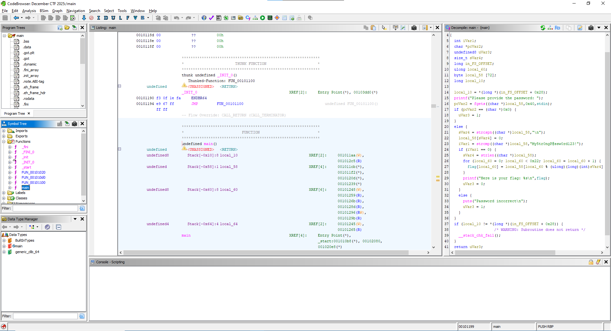
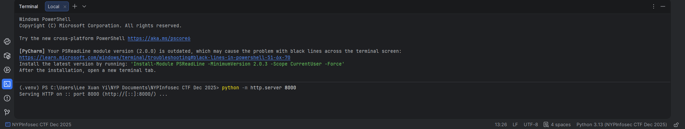
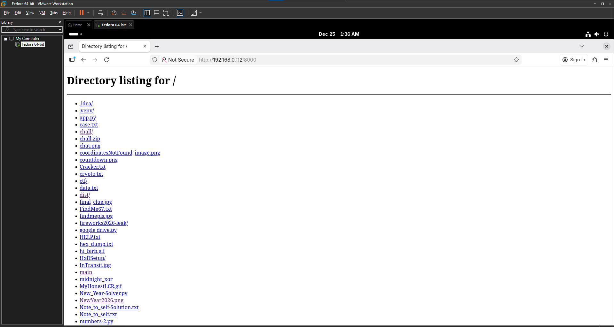
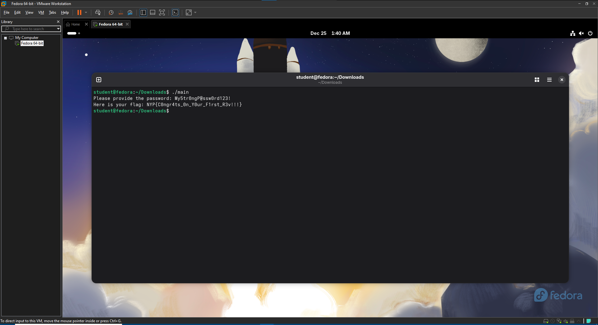

# BabyRev

**Difficulty: very easy**  
**Points: 500 --> 440**  
**Solves: 12**  

---

## Hints
- Ghidra is a very popular disassembly program, and even provides a pseudo-C translation of the assembly code for ease of reading
- The program checks for a hard-coded password, and decrypts the flag using it.

---

## Challenge Description

Welcome to your first reverse engineering challenge! Just open the program in your favourite disassembler of your choice, and get the flag.

---

## Solve

I'm given a main file. The description and hints wants me to download a decompiler like Ghidra, so I did so and opened the main file and analyzed it. 

First I go to the main function and look at the decompiled code.

In the code it required a password: My5tr0ngP@ssw0rd123! 

To run the code, I need a linux environment so I downloaded Fedora43 from my Operating Systems module and ran it in my Virtual Environment.

To transfer the file to the VM, I opened python and ran the code "python -m http.server 8000" in the terminal. This starts a HTTP server on port 8000 for my local machine.

I used the VM, opened firefox and typed in "http://192.168.0.112:8000/", which shows all files in the directory of the python server.

I downloaded the "main" file and ran the command `./main` in the terminal at the Downloads directory to run the function

A password was prompted and I filled in "My5tr0ngP@ssw0rd123!" which was found in Ghidra

The flag is: NYP{C0ngr4ts_0n_Y0ur_F1rst_R3v!!!}