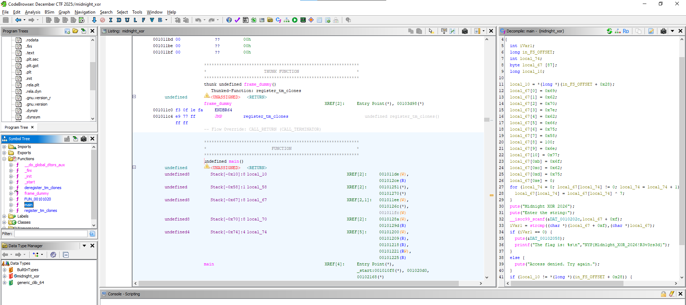

# midnight xor

**Difficulty: easy**  
**Points: 500 --> 468**  
**Solves: 9**  

---

## Hints

---

## Challenge Description

Midnight XOR A mysterious program hides its flag behind an XOR veil. Can you reverse engineer it and recover the secret?

---

## Solve

I opened the file using Ghidra and analyzed the file.

First I go to the "Functions" directory and went to the "main" function.

I examined the code and found the flag quite easily...

The flag is: NYP{M1dn1ght_X0R_2026!R3v3rs3d}