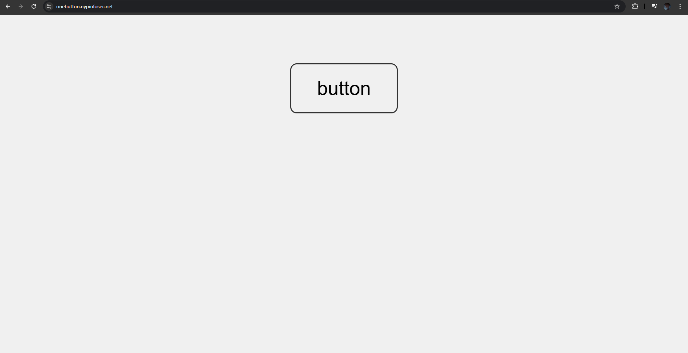
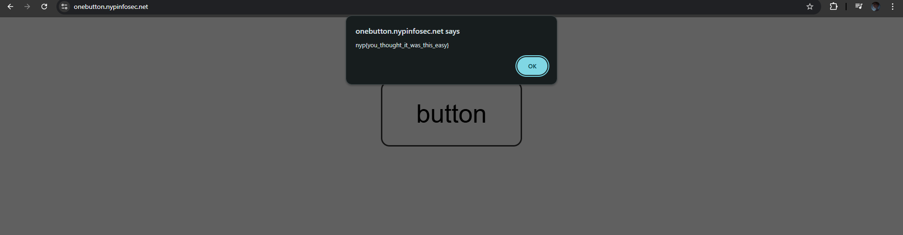
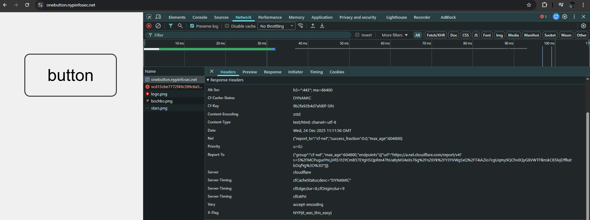

# A big website with one button in it

**Difficulty: very easy**  
**Points: 500 --> 338**  
**Solves: 19**  

---

## Hints

---

## Challenge Description

a big website with one button in it

onebutton.nypinfosec.net

---

## Solve

When loaded into the page, it shows:

When clicked on the Button, it shows a fake flag:

I pressed F12 to access developer tools and looked around for clues

I went to the "Network" section and pressed F5 to refresh the page. At the Response Headers, the X-Flag section shows the flag

The flag is: NYP{it_was_this_easy}
