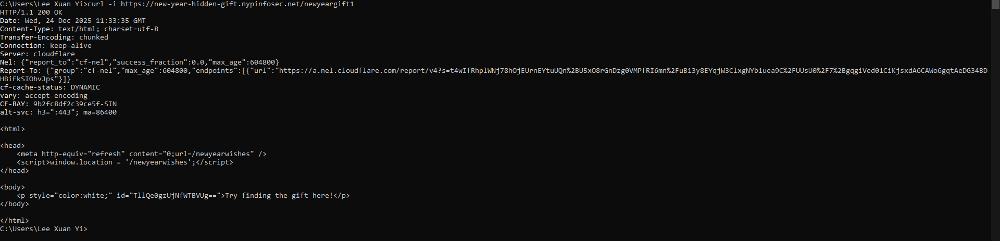
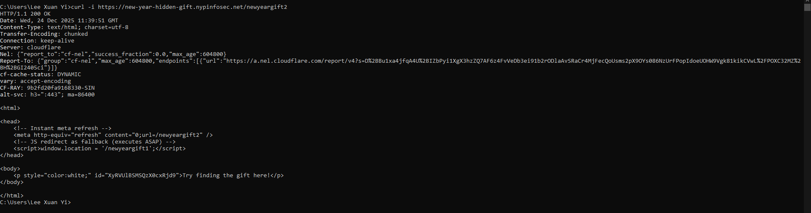
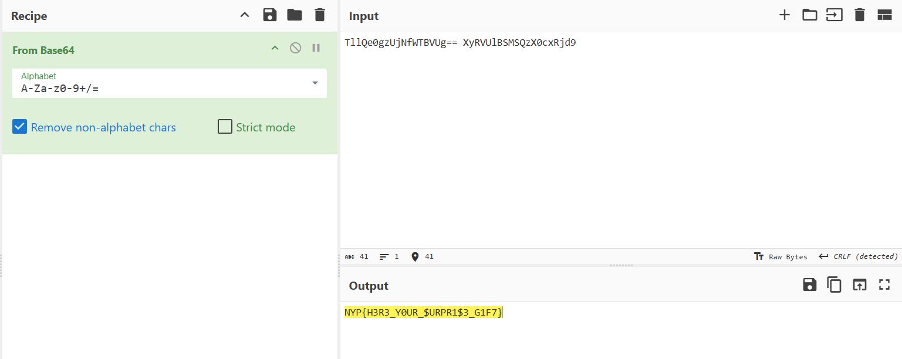

# New Year Hidden Gift

**Difficulty: easy**  
**Points: 500 --> 428 **  
**Solves: 13**  

---

## Hints
- Can’t find the flag fragments in the redirect pages? Look closely — something in their content doesn’t quite belong. It may need be transformed into something readable

---

## Challenge Description

Happy New Year! 🎉

I’ve prepared a special New Year gift for you — the flag. But this gift has been split into two fragments and hidden somewhere along a fast sequence of redirects before reaching the final page.

Your browser moves too quickly to display what happens in between, so you may need to inspect the requests occurring during the redirect chain.

Find fragments of the gift, then combine them to reveal the complete gift.

The final page is just a celebration — the real gift is hidden in the redirects before you get there. 🎆

Good luck, and enjoy the hunt!

new-year-hidden-gift.nypinfosec.net

---

## Solve

When loaded into the page, it quickly redirects the user to 2 different pages before landing on the newyearwishes page.

To see the redirects, I pressed F12 to access developer tools, went to the Network section and ticked the "Preserve log" checkbox. Afterwards refresh with F5 and the redirects show up

However, when accessing the response section it shows an error.

I opened command prompt and typed in the command "curl -i https://new-year-hidden-gift.nypinfosec.net/newyeargift1" to display the response message.

- curl is a command tool used to fetch URLs
- -1 tells curl to include HTTP headers

In the body it has a suspicious id, which looks like Base64 as it ends with "=="

ID: TllQe0gzUjNfWTBVUg==

Repeat the same step for newyear2:

ID: XyRVUlBSMSQzX0cxRjd9

When combined and decoded using Cyberchef from Base64, it shows:

The flag is: NYP{H3R3_Y0UR_$URPR1$3_G1F7}