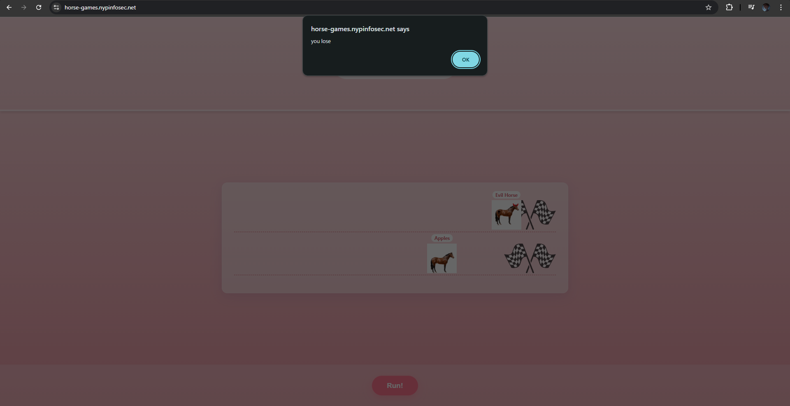
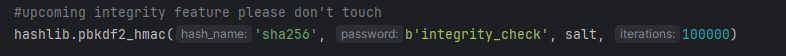

# horse games

**Difficulty: easy**  
**Points: 500 --> 450 **  
**Solves: 11**  

---

## Hints
- If only apples could run twice in one instant

---

## Challenge Description

To celebrate the new year we are having a horse race! I've got alot of money riding on apples please make sure he wins.

horse-games.nypinfosec.net

---

## Solve

When loaded, it shows 2 horses and a Run button. However, apples always loses the race.

In the app.py, there is a suspicious function which creates an artificial delay, forcing the server to pause for a fraction of a second 

Furthermore, the check win condition is ran first before checking if the evil horse wins. 

I used BurpSuite to send multiple requests at once to the server.
- Send the HTTP request to repeater
- Duplicate about 15 tabs and group them together
- Send in group (parallel)

The flag is: NYP{1_L0v3_Hor5e_6am8lin}