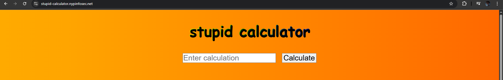
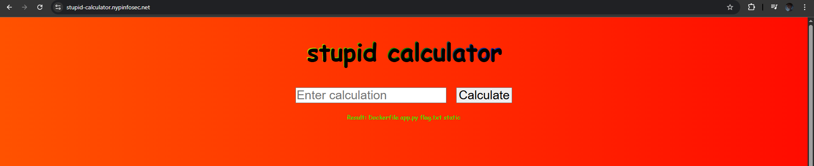
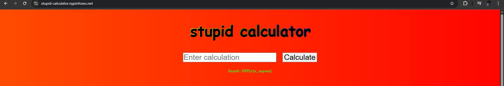
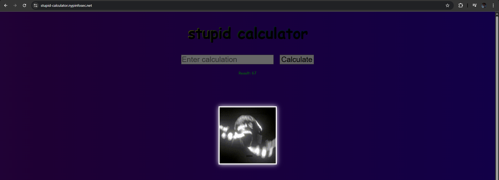

# stupid calculator

**Difficulty: easy**  
**Points: 500 --> 468**  
**Solves: 9**  

---

## Hints
- Something something file containing flag

---

## Challenge Description

This is a stupid calculator

stupid-calculator.nypinfosec.net

---

## Solve

The website is a calculator allowing users to calculate answers (the color is killing my eyes)

I suspect it is using the python 'eval()' function to process the input, which allows users to perform code injection

To confirm this, I injected the code '__import__('os').popen('ls').read()'

Afterwards, I injected code:'__import__('os').popen('cat flag.txt').read()' to read the flag

The flag is: NYP{s1x_sayven} 

67.

